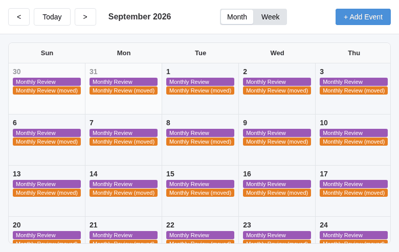
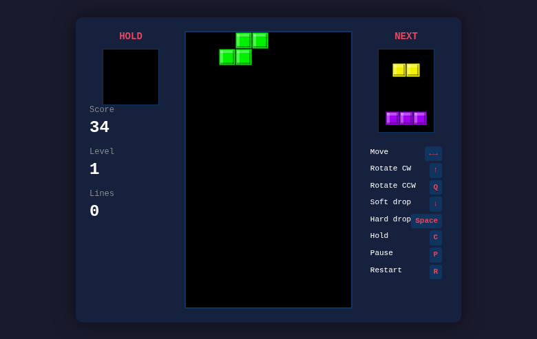

# Qwen3-Coder-Next (UD-Q6_K_XL): fast, and last

_2026-09-04 · opencode-bench research report · ratings by `[auto:claude]` per the in-app rubric (human re-rating welcome — human ratings always win)_

**Verdict: last place at 41.1/100** — the most surprising result the bench has
produced. A coder-tuned 80B MoE that decodes at 186 tok/s and finished the
whole 20-task batch in 52 minutes (the fleet record by a wide margin) also
delivered the weakest work: 5/10 checks and a 3.90 mean app rating, below
gpt-oss-120b's previous floor. Speed came from writing everything in one shot
and never verifying any of it.

## Model and serving configuration

|          |                                                                                                                                                                     |
| -------- | ------------------------------------------------------------------------------------------------------------------------------------------------------------------- |
| Model    | Qwen/Qwen3-Coder-Next — 80B MoE, ~3B active, coder-tuned, non-thinking only, 262K native context                                                                    |
| Quant    | unsloth UD-Q6_K_XL, 69 GB on disk (3 shards)                                                                                                                        |
| Serving  | llama.cpp b10759 behind llama-swap; **`-ngl 99` required** — auto offload mis-sized itself during a model swap and left most layers on CPU (15.9 tok/s until fixed) |
| Speed    | 186 tok/s decode measured standalone; 176.7 tok/s median across the batch; ~96 s cold load                                                                          |
| Sampling | temp 1.0, top-p 0.95, top-k 40, min-p 0.01, repeat penalty 1.0 (model card)                                                                                         |

## Results

| Rank   | Model                   | Score    | Checks   | Rating (n)    |
| ------ | ----------------------- | -------- | -------- | ------------- |
| 1      | Qwen3.8-Flash-Next-IQ4  | 83.9     | 9/10     | 8.00 (9)      |
| …      |                         |          |          |               |
| 11     | gpt-oss-120b            | 43.9     | 6/10     | 3.50 (10)     |
| **12** | **Qwen3-Coder-Next-Q6** | **41.1** | **5/10** | **3.90 (10)** |

### Objective checks — 5/10

Passed: go-algorithms 5/5, python-expression-engine 9/9, json-pipeline 9/9,
js-duration-lib 8/8, race-fix 3/3. Failed: csv-toolkit 0/3, git-surgery
**0/11**, http-api-contract 0/3, sql-analytics 0/1, and state-machine — where
it spent **6 seconds and 356 tokens** before declaring itself done. Several
failures share that signature: near-instant, minimal-effort attempts with no
test execution before finishing.

### Review apps — every app produced, most of them broken

Unlike Flash-Next (which failed to produce one app but scored 9s on the rest),
Coder-Next produced all ten apps — and shipped runtime-breaking bugs in seven:

| Task             | Rating | What broke                                                                                     |
| ---------------- | ------ | ---------------------------------------------------------------------------------------------- |
| checkers         | 8      | works: moves, AI reply, notation history                                                       |
| physics-sandbox  | 8      | works: 60 fps sim, spawn, sliders                                                              |
| data-dashboard   | 4      | brush (the core feature) throws negative-rect-width errors, never filters; "$1.5w" axis labels |
| spreadsheet      | 4      | constructor exception; demo formula columns empty; edits not confirmably committing            |
| calendar         | 3      | a monthly event renders **every day**; creating one event produced **42 copies**               |
| flowchart-editor | 3      | node creation dead (`shapes[type] is not a function`); nodes can't be dragged                  |
| kanban           | 3      | cards aren't draggable at all — only column headers are; WIP shows "3/null"                    |
| image-editor     | 2      | root `drawImage` TypeError: no image ever loads, every control inert                           |
| markdown-editor  | 2      | backtick-escaping bug dumps raw JS into the page; nothing renders                              |
| tetris           | 2      | `Tetris.update` recurses infinitely — stack overflow on load, game frozen                      |

## Generation statistics

20 runs: avg 16.0k tokens in / **8.2k out** per task (163k total — one quarter
of Flash-Next's output volume and one sixth of coder-think's), 55 s decode,
155 s wall. The number that explains everything: review apps averaged ~10k
output tokens written in a single pass, with almost no re-reading of files and
no self-testing. The transcripts show one-shot file writes followed by
immediate completion.

## Findings

1. **Token volume is not overhead — it's verification.** Our leaderboard now
   brackets the fleet with a perfect natural experiment: coder-think (52k
   tokens/task, #2) and Coder-Next (8k tokens/task, #12) — and the top four
   models all emit 20k+. Coder-Next's bugs (infinite recursion, broken
   escaping, dead event handlers) are exactly the kind a single test run
   would catch. It never ran one.
2. **"Coding-tuned" benchmarks don't transfer to agentic building.** This
   model reportedly scores well on competitive-programming benchmarks, and
   its 5 passed checks (algorithmic, self-contained) fit that profile. The
   failures cluster in stateful, spec-heavy work: git surgery, API contracts,
   interactive apps.
3. **The A3B speed is real and could be salvaged.** 176 tok/s sustained
   through a batch is the fleet record. If prompting pushed it to verify
   (or the harness enforced a test-before-done loop), its wall-clock headroom
   allows several full rewrites in the time coder-think spends on one draft.
   A follow-up experiment worth running.
4. **Serving gotcha for MoE swaps**: llama.cpp's automatic layer offload can
   size itself against a GPU still occupied by the outgoing model during a
   llama-swap transition. Explicit `-ngl 99` is now our default for every
   fully-resident model.

## Community signal

- [Qwen3-Coder-Next technical report](https://arxiv.org/pdf/2603.00729) emphasizes long-horizon agentic coding and execution-failure recovery — notably at odds with our observed no-verification behavior under opencode; scaffold match likely matters.
- [NVIDIA Spark how-to](https://forums.developer.nvidia.com/t/how-to-run-qwen3-coder-next-on-spark/359571) and [Docker's packaged image](https://hub.docker.com/r/ai/qwen3-coder-next) show fast ecosystem uptake.
- unsloth's [GGUF release](https://huggingface.co/unsloth/Qwen3-Coder-Next-GGUF) (Dynamic 2.0 quants) is what we served.

## Bench bookkeeping

- Batch ran 02:49–03:41 with the GPU otherwise idle (a deferred start had
  held it while the user was active — swap-thrash avoidance is now standing
  practice).
- Storage: second eviction tranche (vllm-era safetensors, ~147 GB) still
  awaiting approval; we're over the 1 TB budget until then.
