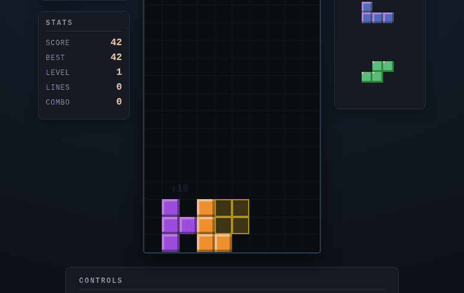

# Qwen3.8-Flash-Next (UD-IQ4_XS): new leaderboard leader

_2026-09-03 · opencode-bench research report · ratings by `[auto:claude]` per the in-app rubric (human re-rating welcome — human ratings always win)_

**Verdict: #1 on the bench at 83.9/100** — 9/10 objective checks and an 8.00
mean rating over 9 review apps, unseating Qwen3.8-27B coder-think (79.4) while
spending roughly half the decode time per task. One significant blemish: on one
review task it fell into the DeepSeek-style failure of dumping an entire file
as chat text instead of calling tools, producing nothing.

## Model and serving configuration

|           |                                                                                                                                                                     |
| --------- | ------------------------------------------------------------------------------------------------------------------------------------------------------------------- |
| Model     | Qwen/Qwen3.8-Flash-Next — 125B MoE, ~6B active (512 experts, 10 routed + 1 shared), 51B n-gram table, 4B MTP head; Qwen4-architecture preview (released 2026-08-26) |
| Attention | hybrid: Gated DeltaNet (3 of 4 layers) + Qwen Sparse Attention (micro-block)                                                                                        |
| Quant     | unsloth UD-IQ4_XS, 88 GB on disk (3 shards)                                                                                                                         |
| Serving   | llama.cpp b10759 (`qwen4exp` support, PR #27742) behind llama-swap                                                                                                  |
| VRAM      | **71 GB at the full native 262K context** — the 51B n-gram table stays memory-mapped in host RAM, off-GPU                                                           |
| Speed     | 92.7 tok/s decode (median 92.6 over the batch); cold boot ~57 s                                                                                                     |
| Sampling  | thinking mode: temp 1.0, top-p 0.95, top-k 20                                                                                                                       |
| Not yet   | MTP self-speculative decode — the drafter is still WIP in llama.cpp                                                                                                 |

### The IQ3 → IQ4 swap

We first ran UD-IQ3_XXS (77 GB): it needed only **57 GB of VRAM at 131K
context** and decoded at 103.6 tok/s. That headroom revealed the n-gram
offload design working as intended, so we stepped up to IQ4_XS — a full extra
bit per weight for ~11% decode speed and doubled context. The IQ3 quant was
deleted after the swap; all scores below are IQ4_XS.

## Results

Composite score = 50% check pass rate + 50% rescaled mean rating.

| Rank  | Model                      | Score    | Checks   | Rating (n)   |
| ----- | -------------------------- | -------- | -------- | ------------ |
| **1** | **Qwen3.8-Flash-Next-IQ4** | **83.9** | **9/10** | **8.00 (9)** |
| 2     | Qwen3.8-27B coder-think    | 79.4     | 9/10     | 7.20 (10)    |
| 3     | gemma-4-31B                | 76.1     | 9/10     | 6.60 (10)    |
| 4     | Qwen3.8-27B coder-fast     | 75.0     | 8/10     | 7.30 (10)    |

### Per-task detail

| Task                                    | Result       | Note                                                                                             |
| --------------------------------------- | ------------ | ------------------------------------------------------------------------------------------------ |
| state-machine                           | pass 10/10   |                                                                                                  |
| python-expression-engine                | pass 9/9     |                                                                                                  |
| json-pipeline                           | pass 9/9     |                                                                                                  |
| js-duration-lib                         | pass 8/8     |                                                                                                  |
| go-algorithms                           | pass 5/5     | race-detector clean                                                                              |
| race-fix                                | pass 3/3     |                                                                                                  |
| csv-toolkit, git-surgery, sql-analytics | pass         | binary-graded                                                                                    |
| http-api-contract                       | **fail 0/3** | the fleet-wide hardest check                                                                     |
| calendar                                | 9            | recurring series with per-occurrence exception, real time-grid week view                         |
| checkers                                | 9            | depth-selectable minimax replies in ~2 s, notation history, forced-capture legend                |
| data-dashboard                          | 9            | brush selection recomputes every KPI; region toggles cross-filter exactly                        |
| flowchart-editor                        | 9            | anchor-based connectors (4/node), orthogonal routing, SVG export                                 |
| image-editor                            | 9            | convolution kernels (blur/sharpen/edge) compose in a reorderable stack                           |
| kanban                                  | 9            | WIP limit genuinely rejects drops into a full column                                             |
| tetris                                  | 9            | hold, next-queue, score popups, best-score persistence                                           |
| physics-sandbox                         | 8            | solid sim at 60 fps; circles only, plainer UI                                                    |
| spreadsheet                             | 8            | hit the 45-min timeout **but the artifact works** — edits propagate through the dependency graph |
| markdown-editor                         | **1**        | **no app: 0 tool calls, 32k tokens dumped as chat text over 509 s**                              |

## Generation statistics

20 runs: avg 19.3k tokens in / 31.9k out per task (638.6k total out), 438 s
decode, 590 s wall. First token averaged 57 s but the tail is long — worst
case **560 s**, dominated by prompt processing on large agent contexts
(prefill measured ~180 tok/s, far below its 92.7 tok/s decode; the sparse
attention path currently favors decode over prefill in llama.cpp).

## Findings

1. **Efficiency, not brute force, took the crown.** Flash-Next scored 4.5
   points above coder-think while emitting 31.9k output tokens/task to
   coder-think's 52k and finishing each task in 10 min vs 13.5. The 6B-active
   MoE with n-gram lookup is doing more per token, not just more tokens.
2. **The review apps are uniformly strong.** Six 9s in nine graded apps —
   every app interaction-tested, not just loaded. The dashboard's brush, the
   kanban's WIP enforcement, and the checkers AI all worked on first probe.
   The fleet's previous best apps (coder-fast, 7.30 avg) were less consistent.
3. **The text-dump failure mode has reached local models.** markdown-editor
   produced zero tool calls and 32k tokens of chat text — deterministic
   behavior we previously saw only from hosted DeepSeek on large single-file
   outputs. One task in ten; worth a retry experiment and a re-test when the
   MTP-aware GGUF re-exports land.
4. **Prefill is the current tax.** With no MTP drafter and slow sparse-attention
   prefill in llama.cpp, long-context agent turns wait up to 9 minutes for the
   first token. Decode itself is faster than every model above 40 tok/s on our
   board except the two speculative-decode configs.

## Community signal

Early coverage (release was a week ago; no official benchmarks yet):

- [Digital Spaceport's notes](https://digitalspaceport.com/qwen3-8-flash-next-notes/) highlight the same thing our VRAM numbers show: n-gram offloading makes a Q4 of a 125B model practical on a single card.
- [BuildFastWithAI's review](https://www.buildfastwithai.com/blogs/qwen3-8-flash-next-review-benchmarks-cost-is-it-worth-it-2026) frames it as a Qwen4 architecture preview rather than a production flagship.
- [NVIDIA's technical blog](https://developer.nvidia.com/blog/experiment-with-qwen3-8-flash-next-on-nvidia-gb300-nvl72-for-agentic-coding/) pushes it specifically for agentic coding experiments.
- llama.cpp support merged a day after release ([PR #27742](https://github.com/ggml-org/llama.cpp/pull/27742)); the MTP drafter remains WIP there, so speculative decode — the architecture's headline speed feature — is still untapped locally.

## Bench bookkeeping

- IQ3_XXS quant evicted after the swap (−78 GB). LLM storage remains over the
  1 TB budget pending the approved AesSedai/bartowski/gpt-oss-F16 deletions.
- Auto-ratings were calibrated against the existing human-rated fleet; all
  carry `[auto:claude]` notes and can be re-rated in the Review tab.
